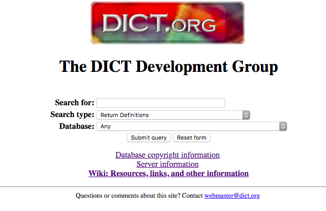

# Using cURL To Query An Online Dictionary

## Introduction

We often face situations where we need to verify the meaning of a word or simply translate it. Being able to verify a word in the dictionary without opening a browser can be very handy.  In this article, we are going to demonstrate how to use the command line tool `curl` to query an online dictionary such as `dict.org`.

### cURL
cURL[1] is a software project providing a library,`libcurl` and the command line tool `curl`. `curl` is used to transfer data to or from a server and supports numerous protocols such as DICT, FILE, FTP, FTPS, GOPHER, HTTP, HTTPS,  IMAP,
IMAPS,  LDAP,  LDAPS,  POP3,  POP3S,  RTMP, RTSP, SCP, SFTP, SMB, SMBS,
SMTP, SMTPS, TELNET and TFTP. 

### DICT Protocol
DICT is a dictionary network protocol created by the DICT Development Group.[2] The protocol operates on TCP port 2628.

### dict.org
`dict.org` is a website that hosts several dictionaries and understands the DICT dictionary protocol. It also provides a web interface to query the dictionaries.



## Query a word
Look up the definition of a word by using the command:

```shell
    curl dict://dict.org/d:<word>
```

`curl` can automatically communicate with `dict.org` using the DICT protocol, so the `dict://` can be omitted in queries.

e.g Defining `telephone`:

```shell
curl dict.org/d:telephone

220 pan.alephnull.com dictd 1.12.1/rf on Linux 4.4.0-1-amd64 <auth.mime> <12788333.7639.1519406212@pan.alephnull.com>
250 ok
150 2 definitions retrieved
151 \"Telephone\" gcide \"The Collaborative International Dictionary of English v.0.48\"
Telephone \Tel\"e*phone\, n. [Gr. ? far off + ? sound.] (Physics)
   An instrument for reproducing sounds, especially articulate
   speech, at a distance.
   [1913 Webster]

   Note: The ordinary telephone consists essentially of a device
         by which currents of electricity, produced by sounds
         through the agency of certain mechanical devices and
         exactly corresponding in duration and intensity to the
         vibrations of the air which attend them, are
         transmitted to a distant station, and there, acting on
         suitable mechanism, reproduce similar sounds by
         repeating the vibrations. The necessary variations in
         the electrical currents are usually produced by means
         of a microphone attached to a thin diaphragm upon which
         the voice acts, and are intensified by means of an
         induction coil. In the magnetic telephone, or
         magneto-telephone, the diaphragm is of soft iron placed
         close to the pole of a magnet upon which is wound a
         coil of fine wire, and its vibrations produce
         corresponding vibrable currents in the wire by
         induction. The mechanical, or string, telephone is a
         device in which the voice or sound causes vibrations in
         a thin diaphragm, which are directly transmitted along
         a wire or string connecting it to a similar diaphragm
         at the remote station, thus reproducing the sound. It
         does not employ electricity.
         [1913 Webster]
.
151 \"Telephone\" gcide \"The Collaborative International Dictionary of English v.0.48\"
Telephone \Tel\"e*phone\, v. t.
   To convey or announce by telephone.
   [1913 Webster]
.
250 ok [d/m/c = 2/0/18; 0.000r 0.000u 0.000s]
221 bye [d/m/c = 0/0/0; 0.000r 0.000u 0.000s]

```

There can be cases where no definitions are found:

```shell
curl dict.org/d:smartphone

220 pan.alephnull.com dictd 1.12.1/rf on Linux 4.4.0-1-amd64 <auth.mime> <12788573.11258.1519406381@pan.alephnull.com>
250 ok
552 no match [d/m/c = 0/0/148; 0.000r 0.000u 0.000s]
221 bye [d/m/c = 0/0/0; 0.000r 0.000u 0.000s]
```

## Refining searches
Querying `dict.org` directly returns results from the first dictionary in which the query matches. In the above example, the dicitonary is `The Collaborative International Dictionary of English v.0.48`. However, dict.org contains several dictionaries. To list all available dicitionaries:[3]

```shell
curl dict.org/show:db

220 pan.alephnull.com dictd 1.12.1/rf on Linux 4.4.0-1-amd64 <auth.mime> <12789237.19828.1519406821@pan.alephnull.com>
250 ok
110 72 databases present
gcide "The Collaborative International Dictionary of English v.0.48"
wn "WordNet (r) 3.0 (2006)"
moby-thesaurus "Moby Thesaurus II by Grady Ward, 1.0"
elements "The Elements (07Nov00)"
vera "V.E.R.A. -- Virtual Entity of Relevant Acronyms (September 2014)"
jargon "The Jargon File (version 4.4.7, 29 Dec 2003)"
foldoc "The Free On-line Dictionary of Computing (18 March 2015)"
easton "Easton's 1897 Bible Dictionary"
hitchcock "Hitchcock's Bible Names Dictionary (late 1800's)"
bouvier "Bouvier's Law Dictionary, Revised 6th Ed (1856)"
devil "The Devil's Dictionary (1881-1906)"
...

```

To query a word using a specific dictionary:

`curl dict.org/d:<word>:<dict>`

e.g Look up `algorithm` in "The Free On-line Dictionary of Computing":

```shell
curl dict.org/d:algorithm:foldoc

151 "algorithm" foldoc "The Free On-line Dictionary of Computing (18 March 2015)"
algorithm

   <algorithm, programming> A detailed sequence of actions to
   perform to accomplish some task.  Named after the Iranian,
   Islamic mathematician, astronomer, astrologer and geographer,
   {Muhammad ibn Musa al-Khwarizmi}.

   Technically, an algorithm must reach a result after a {finite}
   number of steps, thus ruling out {brute force} search methods
   for certain problems, though some might claim that brute force
   search was also a valid (generic) algorithm.  The term is also
   used loosely for any sequence of actions (which may or may not
   terminate).

   {Paul E. Black's Dictionary of Algorithms, Data Structures,
   and Problems (http://nist.gov/dads/)}.

   (2002-02-05)

```

## Translating a word

`dict.org` also contains several translation dictionaries such as the "French-English FreeDict Dictionary".
To translate a word, simply look for it in the corresponding dictionary.

E.g Translating `keyboard` to french:

```shell
curl dict.org/d:keyboard:fd-eng-fra

keyboard /kiːbɔːd/
 clavier
```

## Conclusion
Finding information quickly and easily from the command line interface can be very helpful. In this article we introduced how to use the command line utility `curl` to query an online dictionary `dict.org` using the DICT protocol. Queries can be limited to certain dictionaries which also allow translation.

## References

[1] https://en.wikipedia.org/wiki/CURL

[2] https://en.wikipedia.org/wiki/DICT

[3] https://www.thegeekstuff.com/2012/04/curl-examples/?utm_source=feedburner

[4] http://www.dict.org/links.html