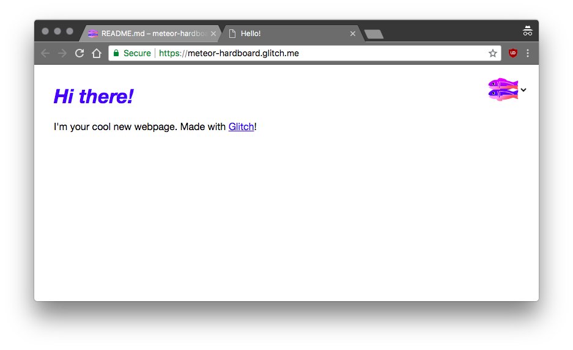

# Getting Started with Glitch

## Introduction

Glitch is an online community that makes building, hosting and deploying javascript web apps very easy and for free. Glitch is built by Fog Creek Software. It features several apps in different categories such as Games, Tools for Work, Bots and much more! 

In this article we are going to see how to get started with the Glitch platform.

## First steps

Although you can get started directly, it is advisable to sign in so that you can easily find your apps next time. You can choose to sign in using Github or Facebook.


Glitch provides a unique way of getting started with a project. Instead of starting with a blank project, Glitch allows you to REMIX a full working app. You can start by remixing web apps already made and shared by the community:


Or, create one based on the three templates that Glitch provides:

1. hello-webpage
2. hello-express
3. hello-sqlite


## Making a simple webpage
Start by remixing the `hello-webpage` app. This creates an app from the template, giving it a unique name. you are presented with a README.md including directions on how to proceed.

The `hello-webpage` project has the following structure:

```
.
├── README.md
├── index.html
├── public
├── script.js
├── style.css
└── views

2 directories, 4 files
```
You can see you app live by clicking on the `Show` button at the top. The website will open on a new tab at is available at `https://<unique-app-name>.glitch.me`



This is a live preview. Any modifications made to the source files are reflected in the app.

## Remixing the `hello-webpage` app

We can modify the content of the `index.html` file to the following:

```html
<!DOCTYPE html>
<html lang="en">
  <head>
    <title>Hello, SUPINFO!</title>
    <meta charset="utf-8">
    <meta http-equiv="X-UA-Compatible" content="IE=edge">
    <meta name="viewport" content="width=device-width, initial-scale=1">
    
    <!-- import the webpage's stylesheet -->
    <link rel="stylesheet" href="/style.css">
    
    <!-- import the webpage's javascript file -->
    <script src="/script.js" defer></script>
  </head>  
  <body>
    <h1>Hello, SUPINFO!</h1>
    
    <p>
      I'm your cool new webpage. Made with <a href="https://glitch.com">Glitch</a>!
    </p>

    <!-- include the Glitch button to show what the webpage is about and
          to make it easier for folks to view source and remix -->
    <div class="glitchButton" style="position:fixed;top:20px;right:20px;"></div>
    <script src="https://button.glitch.me/button.js"></script>
  </body>
</html>

```

As we make changes, we can see the live updates.


We can also add interactivity by modifying the javascript file.

Modify the `script.js` file to the following:

```js
/* If you're feeling fancy you can add interactivity 
    to your site with Javascript */

// Alerts "hi, Supinfo!" in the browser's
alert('hi, Supinfo!');
```


Of course, you are not limited to this. you can create additional files and even upload assets such as images.

## Develop Node.js apps

## What next?

## Conclusion

## References
1. https://medium.com/glitch/what-is-glitch-90cd75e40277
2. https://glitch.com/about