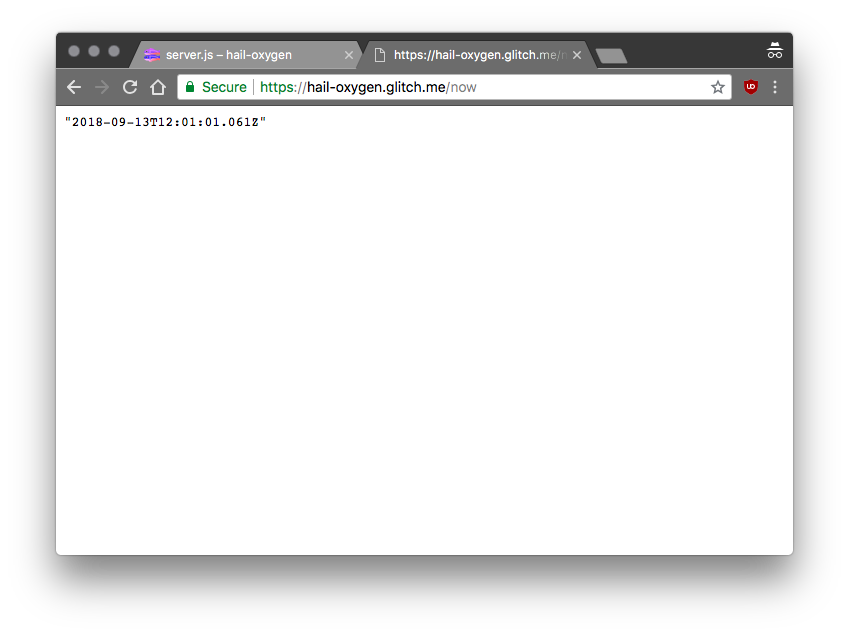

# Getting Started with Glitch

## Introduction

Glitch is an online community that makes building, hosting and deploying javascript web apps very easy and for free. Glitch is built by Fog Creek Software. It features several apps in different categories such as Games, Tools for Work, Bots and much more! 

In this article we are going to see how to get started with the Glitch platform.

## Prerequisites

This article assumes some familiarity with Javascript and Node.js programming and the Express.js framework.

## First steps

Although you can get started directly, it is advisable to sign in so that you can easily find your apps next time. You can choose to sign in using Github or Facebook.


Glitch provides a unique way of getting started with a project. Instead of starting with a blank project, Glitch allows you to REMIX a full working app. You can start by remixing web apps already made and shared by the community:


Or, create one based on the three templates that Glitch provides:

1. hello-webpage
2. hello-express
3. hello-sqlite


## Making a simple webpage
Start by remixing the `hello-webpage` app. This creates an app from the template, giving it a unique name. you are presented with a README.md including directions on how to proceed.

The `hello-webpage` project has the following structure:

```
.
├── assets
├── README.md
├── index.html
├── public
├── script.js
├── style.css
└── views

2 directories, 4 files
```
You can see you app live by clicking on the `Show` button at the top. The website will open on a new tab at is available at `https://<unique-app-name>.glitch.me`


This is a live preview. Any modifications made to the source files are reflected in the app.

## Remixing the `hello-webpage` app

We can modify the content of the `index.html` file to the following:

```html
<!DOCTYPE html>
<html lang="en">
  <head>
    <title>Hello, SUPINFO!</title>
    <meta charset="utf-8">
    <meta http-equiv="X-UA-Compatible" content="IE=edge">
    <meta name="viewport" content="width=device-width, initial-scale=1">
    
    <!-- import the webpage's stylesheet -->
    <link rel="stylesheet" href="/style.css">
    
    <!-- import the webpage's javascript file -->
    <script src="/script.js" defer></script>
  </head>  
  <body>
    <h1>Hello, SUPINFO!</h1>
    
    <p>
      I'm your cool new webpage. Made with <a href="https://glitch.com">Glitch</a>!
    </p>

    <!-- include the Glitch button to show what the webpage is about and
          to make it easier for folks to view source and remix -->
    <div class="glitchButton" style="position:fixed;top:20px;right:20px;"></div>
    <script src="https://button.glitch.me/button.js"></script>
  </body>
</html>

```

As we make changes, we can see the live updates.


We can also add interactivity by modifying the javascript file.

Modify the `script.js` file to the following:

```js
/* If you're feeling fancy you can add interactivity 
    to your site with Javascript */

// Alerts "hi, Supinfo!" in the browser's
alert('hi, Supinfo!');
```


Of course, you are not limited to this. you can create additional files and even upload assets such as images.

## A Node.js app

The most powerful feature of Glitch is the ability to develop `Node.js` apps right in the browser.

Get started by creating a project based on the `hello-express` app. The project has the following structure:

```
.
├── assets
├── README.md
├── package.json
├── public
│   ├── client.js
│   └── style.css
├── server.js
├── shrinkwrap.yaml
└── views
    └── index.html

2 directories, 7 files
```
The `README.md` contains the following useful instructions:

- Front-End:
    - The files related to the front end live in the `public` directory
    - We can add files such as images, and other media in the `assets` directorys

- Back-End:
    - The Node app starts at `server.js`
    - We can add additional packages by modifying the `package.json` file

Indeed, since we just remixed the express demo app, the `package.json` only has `express` as dependency:

```json
{
  "//1": "describes your app and its dependencies",
  "//2": "https://docs.npmjs.com/files/package.json",
  "//3": "updating this file will download and update your packages",
  "name": "hello-express",
  "version": "0.0.1",
  "description": "A simple Node app built on Express, instantly up and running.",
  "main": "server.js",
  "scripts": {
    "start": "node server.js"
  },
  "dependencies": {
    "express": "^4.16.3"
  },
  "engines": {
    "node": "8.x"
  },
  "repository": {
    "url": "https://glitch.com/edit/#!/hello-express"
  },
  "license": "MIT",
  "keywords": [
    "node",
    "glitch",
    "express"
  ]
}
```

Modify the `package.json` to use the `moment` package by adding it to the dependcies:

```json
{
  "name": "hello-express",
  "version": "0.0.1",
  "description": "A simple Node app built on Express, instantly up and running.",
  "main": "server.js",
  "scripts": {
    "start": "node server.js"
  },
  "dependencies": {
    "express": "^4.16.3",
    "moment":"2.22.2"
  },
  "engines": {
    "node": "8.x"
  },
  "repository": {
    "url": "https://glitch.com/edit/#!/hello-express"
  },
  "license": "MIT",
  "keywords": [
    "node",
    "glitch",
    "express"
  ]
}

```

We can define a new route which uses the newly added package. There is no need to do `npm install`, Glitch takes care of this.

Edit the `server.js` to the following:

```js
// server.js
// where your node app starts

// init project
var express = require('express');
var app = express();
var moment = require('moment')

// we've started you off with Express, 
// but feel free to use whatever libs or frameworks you'd like through `package.json`.

// http://expressjs.com/en/starter/static-files.html
app.use(express.static('public'));

// http://expressjs.com/en/starter/basic-routing.html
app.get('/', function(request, response) {
  response.sendFile(__dirname + '/views/index.html');
});

//#################################################
// add a route to get the time using moment.js
app.get('/now',function(request, response){
  response.send(moment());
});
//#################################################

// listen for requests :)
var listener = app.listen(process.env.PORT, function() {
  console.log('Your app is listening on port ' + listener.address().port);
});

```
 When we hit the `/now` endpoint on our app, it should send the date and time

 

That's it! you can explore the glitch platform further, and even create awesome projects that others can remix.

## Conclusion
This article gives an overview of the Glitch platform which allows easy and free Javascript and Node.js development in the browser. Glitch provides working example apps that users can start with and build their projects upon.

## References
1. https://medium.com/glitch/what-is-glitch-90cd75e40277
2. https://glitch.com/about