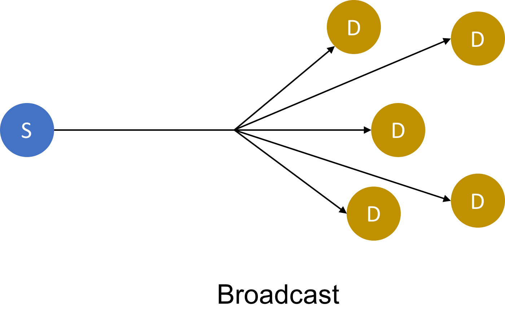
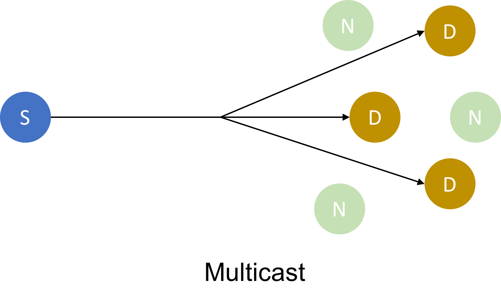

# Network Addressing Methods

## Introduction
The purpose of a network is to provide a means to communicate information.  One of the most important aspect of communication, is how the information is to be delivered. A person or service may choose to send information to an individual or a group of persons/services. There are essentially four patterns of communication in a network, namely Unicast, Broadcast, Multicast and Anycast. In this article, we are going to briefly describe these patterns, give some examples of protocols that utilise them and make comparisons.

## Unicast

Unicast refers to one-to-one communication, that is the information flows from one point(sender) to exactly another point(receiver) in the network. Each point has a unique address in the network. A simple analogy is when you send an sms to a friend.

Unicast is the predominant form of transmission in most networks. Popular application protocols such as http, ftp and smtp use unicast transmission. 

## Broadcast

Broadcasting uses one-to-all communication, that is information flows from one point to all possible points in the scope of the network.In this case, the sender has a unique address while in the destination address all bits will be set to 1. For a broadcast, the MAC address is FF:FF:FF:FF:FF:FF and IP address is 255.255.255.255. Importantly, the IPv6 addressing architecture does not implement broadcast transmission.

Broadcast is typically used when a device needs to send a message to all other devices on the network. ARP and DHCP use broadcasting. 

## Multicast

Multicast is a one-to-many mode of transmission. In multicasting, the message flows from one sender to a group of recipients. A receiving device must request the information. This is acheived by joining a multicast group. Ethernet multicast address have a value of `1` in the least-significant bit of the first octet of the destination address while IPv4 multicast address have leading address bits of `1110` which correspond to Class D group of addresses or CIDR prefix of `224.0.0.0/4` . Multicast IPv6 address use a prefix of ff00::/8 .

Multicasting is very popular in audio and video streaming services.The UDP transport protocol uses multicasting.

## Anycast

Anycast uses one-to-one-of-many communication. It is similar to Multicast, however the information is sent to the nearest of the group of destined receivers which in turn sends the message to other receivers in the group. IPv4 does not specifically support anycast but while IPv6 specifically supports it. An anycast address is indistinguishable from an unicast address, however assignment a unicast address to multiple interfaces makes it an anycast address.

Anycast is used in Domain Naming System(DNS), IPv4 to IPv6 Transition and Content Delivery Networks(CDN).

## Comparison of 

## References
1. https://en.wikipedia.org/wiki/Unicast

2. https://en.wikipedia.org/wiki/Anycast

3. http://www.erg.abdn.ac.uk/users/gorry/course/intro-pages/uni-b-mcast.html

4. https://www.esds.co.in/blog/difference-between-unicast-broadcast-and-multicast/#sthash.I7eEeLgX.dpbs
5. https://en.wikipedia.org/wiki/Multicast_address

6. https://www.cisco.com/c/en/us/td/docs/ios-xml/ios/ipv6/configuration/15-2mt/ip6-15-2mt-book/ip6-anycast-add.html