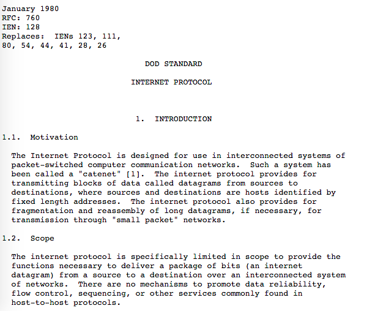

# Request for Comments and Internet Standards

## Introduction

The Internet Engineering Task Force (IETF)[1](https://en.wikipedia.org/wiki/Internet_Engineering_Task_Force) is a non-profit organization. It oversees the development and promotion of Internet Standards such as  the Internet protocol suite (TCP/IP). TCP/IP itself is a set of communication protocols. But how are these protocols standardised? This article discusses Request For Comments(RFCs) and how they can become Internet Standards[2](https://en.wikipedia.org/wiki/Internet_Standard). 

## Request For Comments

Engineers and experts author publications known as Request For Comments(RFC)[3](https://en.wikipedia.org/wiki/Request_for_Comments). An RFC describes approaches, research findings or even opinions related to the Internet. Steve Crocker, part of the team that developed the protocols for the ARPANET, created RFC  in 1969 to help record unofficial notes. There are three RFC subseries- Best Current Practice (BCP), For Your Information (FYI) and Standard (STD).

Each RFC is given a unique serial number. Once assigned and published, an RFC cannot be rescinded or modified. If it requires modifications, the authors must publish a revised document. Older RFCs then become obsolete. Not all RFCs are standards. RFCs intended to become Internet Standards evolve
through a set of maturity levels known as the "standards track".[4](https://tools.ietf.org/html/rfc2026)

## The Internet Standards Track

Section four of RFC 2026 defines the evolution process of an RFC to an Internet Standard. The process involves different stages of development, testing,and acceptance known as "maturity levels". RFC 2026 defined three maturity levels: "Proposed Standard", "Draft Standard", and "Standard". However, RFC 2026 was superseded by RFC 6410 which reduced the Standards Track to two maturity levels: Proposed Standard and Internet Standard [5](https://tools.ietf.org/html/rfc6410). Both RFC 2026 and RFC 6410 characterise Internet Standards as:

> An Internet Standard is characterized by a high degree of technical maturity and by a generally held belief that the specified protocol or service provides significant benefit to the Internet community.

> An Internet Standard ensures that hardware and software produced by different vendors can work together.

All Internet Standards are given a number in the STD series. Unlike RFCs, an Internet Standard retains its STD number even if it is updated. 

## Example of an Internet Standard

The Internet Protocol(IP) is the principal means of communication in the TCP/IP suite. RFC 760, released in January 1980, describes the Internet Protocol. RFC 760 was made obsolete by RFC 791 in September 1981 which described IPv4. RFC 791 was then standardised as STD 5.

## Conclusion
In this article we saw how internet protocols become standardised. The IETF oversees this process and documents everything in publications known as Request For Comments. An RFC can eventually become an Internet Standard through the Internet Standards Track and is characterised by a high degree of technical maturity.

## References
1. https://en.wikipedia.org/wiki/Internet_Engineering_Task_Force

2. https://en.wikipedia.org/wiki/Internet_Standard

3. https://en.wikipedia.org/wiki/Request_for_Comments

4. https://tools.ietf.org/html/rfc2026

5. https://tools.ietf.org/html/rfc6410