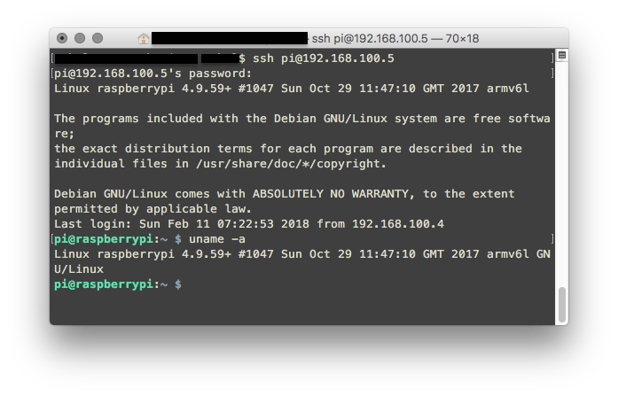

# Some uses of Secure Shell (SSH)

## Introduction
Secure Shell (SSH)[1](https://en.wikipedia.org/wiki/Secure_Shell) is a network protocol originally designed by Tatu Ylönen, a researcher at Helsinki University of Technology, Finland, as a replacement for earlier protocols such as TELNET, ftp and rlogin. SSH version 2(SSH-2) is a revised version of the protocol by the Internet Engineering Task Force (IETF). SSH is primarily favoured over other protocols since it uses public-key cryptography to provide a secured connection. SSH uses the client-server model. While SSH has numerous uses,in this article we are going to illustrate some other common ones such as Remote Login,  Tunneling and File Transfer. 

## Remote Login
This is by far the most popular use for SSH. Essentially, it allows users to connect remotely to a machine. Commands typed in the terminal are executed on the remote server. 

In this case, the remote server runs an SSH Server and the local machine connects to it via an SSH client. This is built into Unix-like operating systems while Windows and other platforms require third-party clients such as PuTTY.

SSH allows clients to be authenticated using password or SSH keys. SSH-key based logins are more secure.

Password logins are quite straightforward. You need to know the remote server's IP address.

In a terminal:
```shell
ssh <username>@<IP>
```


## Tunneling [2](https://en.wikipedia.org/wiki/Tunneling_protocol#Secure_Shell_tunneling) 

SSH Tunneling sets up a secure channel between the client and a server using SSH protocol. Services can be forwarded through this secured, encrypted channel. This is achieved by SSH port forwarding. SSH tunneling is usually used to transmit unencrypted traffic through the encrypted SSH tunnel. SSH tunnels can also be used to bypass firewall rules. There are three types of SSH port forwarding:
- Local Port Forwarding
- Remote Port Forwarding
- Dynamic Port Forwarding

### Local Port Forwarding
Local Port Forwarding is tne most common type of tunneling used. It allows you to connect to another server from your local machine. This is commonly used to bypass certain firewall rules. 

For example, let's assume that `supinfo.com` is blocked on our local network. We could create a tunnel through another server on another network then access it locally.

In a terminal:


```shell
ssh -L 8080:www.supinfo.com:80 user@vps
```
Pointing browser at `http://localhost:8080/` would load the `supinfo.com` website through a tunnel to the remote vps server.

Another use of local port forwarding is to remotely access services that are accessible only when using `127.0.0.1` as the hostname. For example, phpMyAdmin which is an administration tool for MySQL and MariaDB. For instance, we could access phpMyAdmin remotely to manage a MySQL database hosted on amazon AWS. 

```shell
ssh -N -L 8888:127.0.0.1:80 <username>@<AWS instance public IP or DNS>
```
Then, phpMyAdmin would be available on local machine at `http://127.0.0.1:8888/phpmyadmin/`


### Remote Port Forwarding
Remote Port Forwarding, also called Reverse SSH, is used to provide access to a service running locally on the machine from a remote network. A simple example would be sharing access to web app running locally to a colleague with deploying the app. Typically, we would need to know our public IP address and configure NAT and firewall rules to allow someone to connect remotely to services running locally on our machine. 

Remote Port Forwarding allows us to give remote access to local services via a third publicly accessible server. To enable it, the `/etc/ssh/sshd_config` file needs to be modified by adding :

```shell
GatewayPorts yes
```

For example, let's assume we want to share a webapp running locally on `port 8889` to the outside world via a publicly available server.

```shell
ssh -R 8080:localhost:8889 user@<Server IP>
```

Loading `<Server IP>:8080`  in the browser would load the web app running locally at `localhost:8889`


### Dynamic Port Forwarding

Dynamic Port Forwarding turns the SSH client into a SOCKS 4/5 proxy.Socket Secure (SOCKS)[3](https://en.wikipedia.org/wiki/SOCKS) is a protocol that allows information exchange between a client and a server through a proxy server. It allows traffic to bypass Internet filtering to access blocked content. The Onion Router (Tor) offers a SOCKS server interface to its clients.[4](https://www.torproject.org/docs/faq.html.en#TBBSocksPort)

## X11 Forwarding [5](http://www.cs.umd.edu/~nelson/classes/utilities/xforwarding.shtml)

The X Window System (X11) [6](https://en.wikipedia.org/wiki/X_Window_System) also uses the client-server model. Running an X Client on the remote system and an X Server on the local machine, we can access GUI based applications from the remote system. XQuartz is the popular X Server for macOS while Xming is a popular X Server for Windows platform.

To enable X11 Forwarding, the `/etc/ssh/sshd_config` file on the __remote__ machine needs to be modified by adding :

```shell
X11Forwarding yes

X11UseForwarding yes
```

To forward X session over SSH, in a terminal on local machine, run:
```shell
ssh -Y <username>@<IP>
``` 
Then run command in background(by appending `&`, e.g `idle3 &`). The application opens up in a graphical window on the local system.


## File Transfer [7](https://en.wikipedia.org/wiki/Secure_Shell#File_transfer_protocols)

Several file transfer protocols such as Secure Copy(SCP), SSH File Transfer Protocol (SFTP), and rsync use the SSH protocol. They provide a means to securely transfer files between a local and remote host. 

Using `scp `:
To copy file from local machine to remote host, run:
```shell
scp <File> <user>@<remoteHost>:<destination>
```

To copy files from remote host to local machine:
```shell
scp <user>@<remoteHost>:<directory/SourceFile> <TargetFile>
```

Using `STFP`:

To start an interactive sftp session:
```shell
sftp <user>@<remoteHost>
```
The interactive session allows commands such as `cd` and `ls`. To retrieve a file from remote host use `get` and to upload a file use `put`.

```shell
sftp> ls
1LAW  1LIN  1ORC  1WEB  2LAW  2LIN  2ORC  2WEB  3LAW  3LIN  3ORC  3WEB  
sftp> cd 1WEB
sftp> ls
project.txt  
sftp> get project.txt
Fetching /home/supinfo/1WEB/project.txt to project.txt
/home/supinfo/1WEB/project.txt                100%   29     1.6KB/s   00:00 
```

## Conclusion
SSH is a secure network protocol with can be used in different ways. In this article, we described a few uses such as Remote Login, Tunneling and File Transfer. 

## References
- [1] https://en.wikipedia.org/wiki/Secure_Shell
- [2] https://en.wikipedia.org/wiki/Tunneling_protocol#Secure_Shell_tunneling
- [3] https://en.wikipedia.org/wiki/SOCKS
- [4] https://www.torproject.org/docs/faq.html.en#TBBSocksPort
- [5] http://www.cs.umd.edu/~nelson/classes/utilities/xforwarding.shtml
- [6] https://en.wikipedia.org/wiki/X_Window_System
- [7] https://en.wikipedia.org/wiki/Secure_Shell#File_transfer_protocols